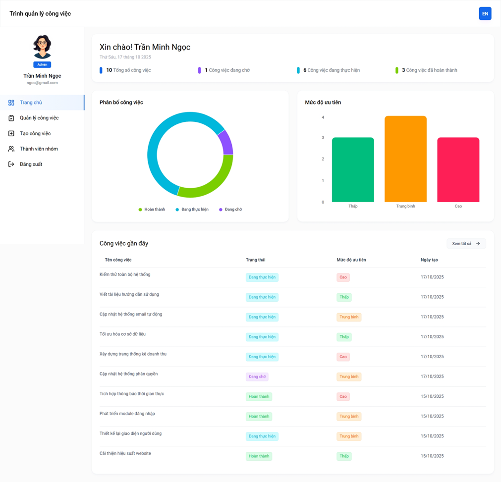
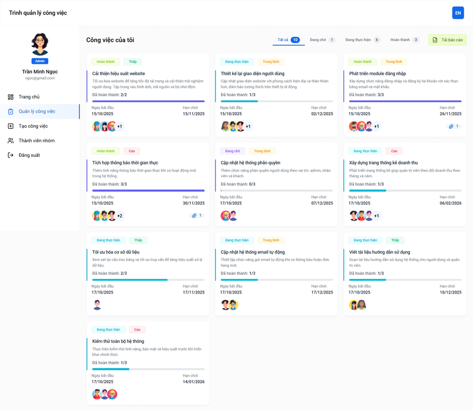

# 🗂️ Task Manager – Hệ thống quản lý công việc trực tuyến

## 🌐 Giới thiệu

**Task Manager** là một ứng dụng web giúp người dùng **tạo, quản lý, phân công và theo dõi tiến độ công việc** theo thời gian thực.  
Hệ thống được xây dựng theo mô hình **Client – Server** sử dụng **MERN Stack** (MongoDB, Express.js, React.js, Node.js).

Ứng dụng phù hợp cho **cá nhân, nhóm làm việc hoặc doanh nghiệp nhỏ**, hỗ trợ:

- Quản lý người dùng và phân quyền.
- Tạo công việc, gán người phụ trách, theo dõi tiến độ.
- Cập nhật trạng thái công việc (Pending → In Progress → Completed).
- Quản lý danh sách công việc theo độ ưu tiên, hạn chót, hoặc người được giao.
- Giao diện trực quan, dễ sử dụng và thân thiện trên mọi thiết bị.

---

## ⚙️ Công nghệ sử dụng

### 🔸 Frontend

- React.js (Vite)
- Tailwind CSS
- Axios
- React Router DOM
- React Icons

### 🔸 Backend

- Node.js + Express.js
- MongoDB (Mongoose)
- Multer (upload file)
- JWT Authentication
- bcrypt.js (hash password)
- CORS

---

## 🧱 Cấu trúc thư mục

```bash
Task-Manager/
│
├── backend/
│ ├── server.js
│ ├── config/
│ ├── controllers/
│ ├── models/
│ ├── routes/
│ └── uploads/
│
├── frontend/
│ ├── src/
│ │ ├── components/
│ │ ├── pages/
│ │ ├── layouts/
│ │ ├── utils/
│ │ └── App.jsx
│ └── package.json
│
└── README.md
```

---

## 🚀 Cách chạy dự án

### 1️⃣ Clone repository

```bash
git clone https://github.com/<your-username>/task-manager.git
cd task-manager
```

2️⃣ Cài đặt dependencies

```bash
# Backend:
cd backend
npm install
```

```bash
# Frontend:
cd ../frontend
npm install
```

3️⃣ Cấu hình môi trường

Tạo file .env trong thư mục backend với nội dung ví dụ:

```bash
PORT=8000
MONGO_URI=mongodb://localhost:27017/task_manager
JWT_SECRET=secretkey123
```

4️⃣ Chạy ứng dụng

Chạy backend:

```bash
cd backend
npm run dev
```

Chạy frontend:

```bash
cd frontend
npm run dev
```

Sau đó mở trình duyệt tại:
👉 http://localhost:5173

🧩 Các tính năng chính

✅ Đăng ký / Đăng nhập người dùng
✅ Tạo công việc mới, thêm checklist
✅ Phân công công việc cho thành viên
✅ Lọc và sắp xếp công việc theo trạng thái hoặc độ ưu tiên
✅ Cập nhật trạng thái (Pending → In Progress → Completed)
✅ Upload ảnh đại diện người dùng
✅ Giao diện responsive

📸 Giao diện minh họa




